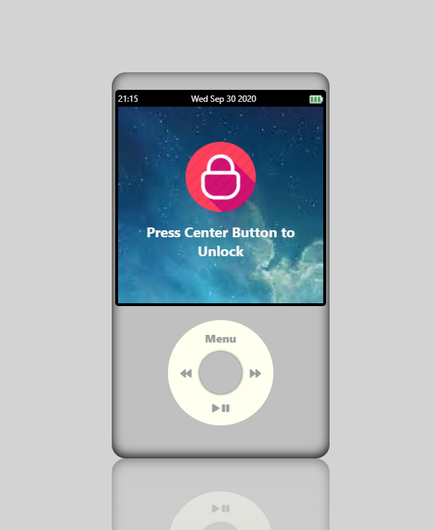
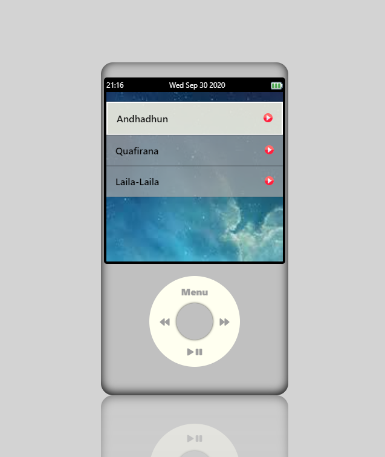
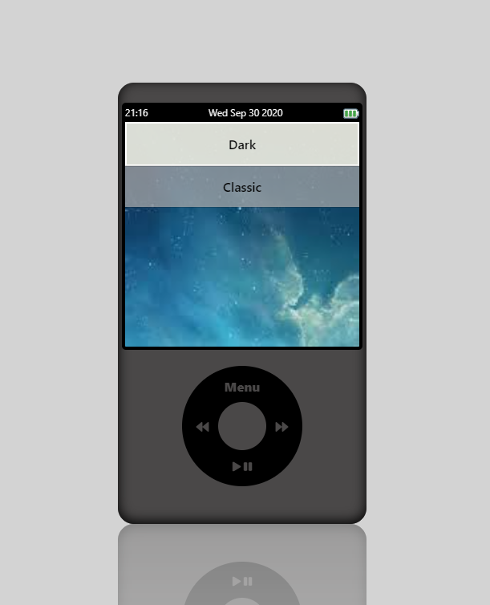
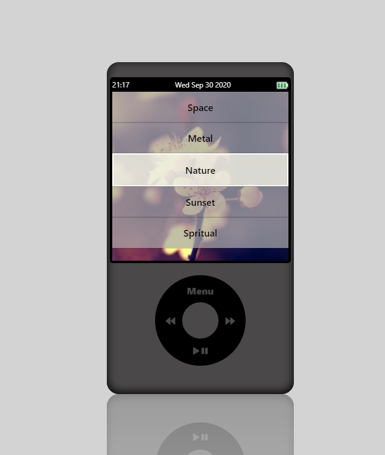

# iPod 
An iPod front-end built using React.js

# Features
- Attractive design inspired by iPod classic.
- Lock/Unlock device feature
- Can play songs by entering music menu
- Functional working of - Play/Pause, Forward, Reverse when in Music
- User can change theme and wallpaper through Settings
- Discover more when entering each menu

Songs and images and GIFs only for personal use, a big credit to font-awesome and flat-icons

## How to Use/Control?

1. To unlock screen you have to press center button and to lock screen you have to press menu button in main menu.
2. Center button to unlock device, enter menu, select menu items
3. Menu button working as back button & lock button on main menu screen
4. When in Music menu - 
    To play and pause music in any menu you need to press play/pause button on bottom. 
    Next/Prev buttons on the controls to change song.
5. To navigate between a menu items you need to rotate on track wheel
6. To go to next menu or go inside a menu press center button and to go to previous menu press menu button

## Preview

### Lock Screen and main menu
</img> </img>

### Playlist and Music player
</img> </img>

### Different theme and wallpaper applied
</img> </img>


## How To Install.

0. Run this app by directly opening the above link or follow steps below to set up on local directory.
1. Clone this project
2. Start by installing npm if you don't have it already.
3. Navigate to Project Directory by :
```
cd iPod-Classic
```
4. run following commands :
```
npm install 
npm start or react-scripts start
```

## Directory Structure

`/src` - all code files <br>
`/src/components` - all react components <br>
`/src/css` - all css files <br>


This project was bootstrapped with [Create React App](https://github.com/facebook/create-react-app).

### Available Scripts

In the project directory, you can run:

#### `yarn start` or `npm start`

Runs the app in the development mode.<br />
Open [http://localhost:3000](http://localhost:3000) to view it in the browser.


